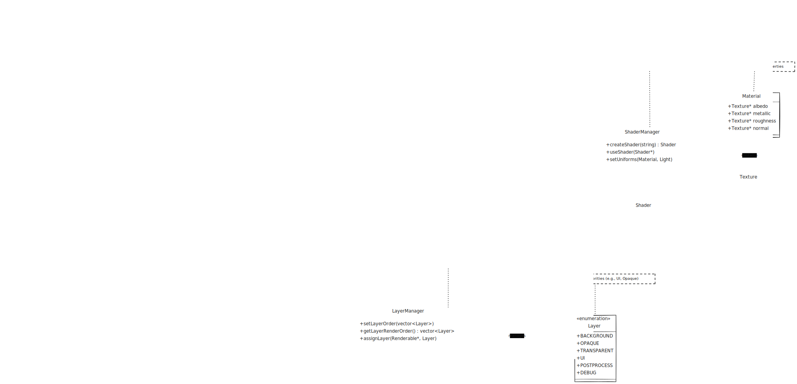

# NightOwlEngine

# Renderer Architecture Documentation  




---

## **Core Responsibilities**  
The Renderer visualizes 3D/2D content efficiently while maintaining flexibility and performance. Core tasks include:  
- **Rendering Objects**: Meshes, UI elements, particles, and post-processing effects.  
- **Shader Management**: Compiling, linking, and applying shader programs.  
- **Lighting**: Dynamic (real-time) and static (baked) lighting.  
- **Layer Management**: Prioritizing draw order and isolating effects via render layers.  
- **Optimization**: Minimizing GPU/CPU overhead through batching, culling, and LOD.  

---

## **Key Features**  
| Feature                 | Description                                                                 |  
|-------------------------|-----------------------------------------------------------------------------|  
| **Physically Based Rendering (PBR)** | Metallic-roughness workflow, BRDF, cubemaps.                              |  
| **Dynamic & Static Lighting** | Real-time shadows, baked lightmaps, ambient occlusion.                   |  
| **Layering System**     | Prioritize rendering order (e.g., UI on top) and isolate effects.          |  
| **Optimizations**       | Batching, frustum culling, LOD, instancing, texture atlasing.              |  

---

## **Modular Architecture**  

### **A. Core Renderer Class**  
**Purpose**: Central coordinator for rendering subsystems.  
**Responsibilities**:  
- Initialize graphics context (OpenGL/Vulkan) and window (GLFW/SDL).  
- Manage the render pipeline (forward/deferred).  
- Expose APIs for registering renderables, lights, and layers.  

**Modularity**:  
- Decoupled from specific techniques (e.g., shading models).  
- Uses abstraction for pipeline, shader, and layer management.  

---

### **B. Shader Manager**  
**Purpose**: Handle shader programs for diverse rendering techniques.  
**Responsibilities**:  
- Load, compile, and cache GLSL/HLSL shaders.  
- Manage uniforms (e.g., camera, lights, materials).  
- Support PBR, post-processing, and UI shaders.  

**Modularity**:  
- Base `Shader` class with derived implementations (e.g., `PBRShader`, `UIShader`).  
- Factory pattern for dynamic shader creation.  

---

### **C. Rendering Pipeline**  
**Purpose**: Define rendering methodology.  
**Options**:  
| Pipeline Type       | Use Case                                   |  
|---------------------|-------------------------------------------|  
| **Forward**         | Simple scenes, dynamic lighting.          |  
| **Deferred**        | Complex scenes with many lights (PBR).    |  

**Modularity**:  
- Encapsulated in a `RenderPipeline` class.  
- Configurable via strategy pattern (swap forward/deferred).  

---

### **D. Lighting System**  
**Purpose**: Manage static and dynamic light sources.  
**Components**:  
- **Static Lighting**: Baked lightmaps, ambient occlusion.  
- **Dynamic Lighting**: Point, spot, and directional lights with shadow mapping.  

**Modularity**:  
- `Light` base class with subtypes (`PointLight`, `DirectionalLight`).  
- `LightingManager` for culling and applying lights.  

---

### **E. Material and Texture System**  
**Purpose**: Manage PBR materials and textures.  
**Responsibilities**:  
- Load/cache textures (e.g., albedo, normal maps).  
- Bind material properties (metallic, roughness) to shaders.  

**Modularity**:  
- `Material` class for PBR properties.  
- `TextureManager` for texture lifecycle management.  

---

### **F. Scene Management**  
**Purpose**: Organize renderables, cameras, and layers.  
**Responsibilities**:  
- Maintain a scene graph of renderable objects.  
- Frustum culling and LOD management.  
- Assign objects to layers (e.g., `Opaque`, `UI`).  

**Modularity**:  
- `Scene` class for renderables and cameras.  
- Integrates with `LayerManager` for layer assignments.  

---

### **G. Layering System**  
**Purpose**: Organize renderables into prioritized groups.  
**Layer Types**:  
| Layer          | Description                                | Render Order |  
|----------------|--------------------------------------------|--------------|  
| `Background`   | Skies, distant environments.              | 1            |  
| `Opaque`       | Solid geometry (terrain, buildings).       | 2            |  
| `Transparent`  | Blended objects (glass, particles).        | 3            |  
| `UI`           | HUD, menus, text.                          | 4            |  
| `PostProcess`  | Full-screen effects (bloom, color grading).| 5            |  
| `Debug`        | Wireframes, collision boxes.               | 6            |  

**Modularity**:  
- `LayerManager` class to configure layer order/visibility.  
- Assign layers via `Renderable.layer` property.  
- Layer-specific settings (e.g., camera, shaders).  

---

### **H. Optimization Module**  
**Purpose**: Enhance rendering performance.  
**Techniques**:  
- **Batching**: Group objects by material/shader.  
- **Instancing**: Render duplicates efficiently (e.g., grass).  
- **Culling**: Skip off-screen objects via frustum culling.  
- **LOD**: Reduce polygon count for distant objects.  

**Modularity**:  
- `RendererOptimizer` class with toggleable optimizations.  

---

## **Implementation Guidelines**  

### 1. **Layer Workflow**  
```cpp  
// Assign a renderable to the UI layer  
Renderable& uiElement = entity.AddComponent<Renderable>();  
uiElement.mesh = quadMesh;  
uiElement.material = uiMaterial;  
uiElement.layer = Layer::UI;  

// Define render order  
LayerManager::SetLayerOrder({  
    Layer::Background,  
    Layer::Opaque,  
    Layer::Transparent,  
    Layer::UI,  
    Layer::PostProcess  
});
void Renderer::Render() {  
    ClearBuffers();  

    for (Layer layer : LayerManager::GetLayerOrder()) {  
        if (LayerManager::IsLayerEnabled(layer)) {  
            // Configure layer-specific settings  
            SetCamera(layer);  
            BindShader(GetShaderForLayer(layer));  

            // Render all objects in this layer  
            auto& renderables = scene.GetRenderables(layer);  
            for (auto& renderable : renderables) {  
                Draw(renderable);  
            }  
        }  
    }  

    ApplyPostProcessing();  
}
```
## **Advanced Techniques Considerations**

- **Bitmask Layers**: Combine layers for filtering (e.g., Layer::Debug | Layer::UI).
- **Custom Render Targets**: Render layers to separate framebuffers (e.g., for compositing).
- **Layer Callbacks**: Add pre/post-render hooks for effects (e.g., blur a layer).
